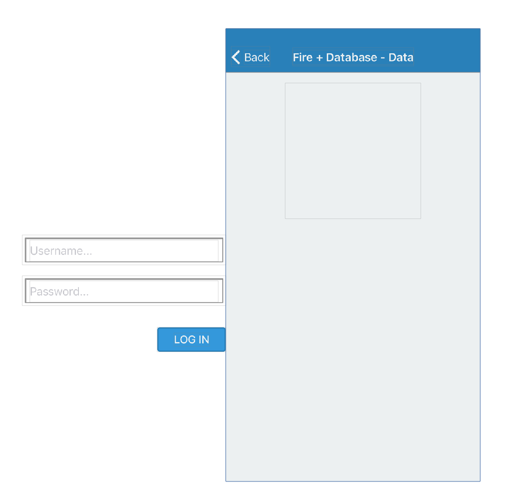
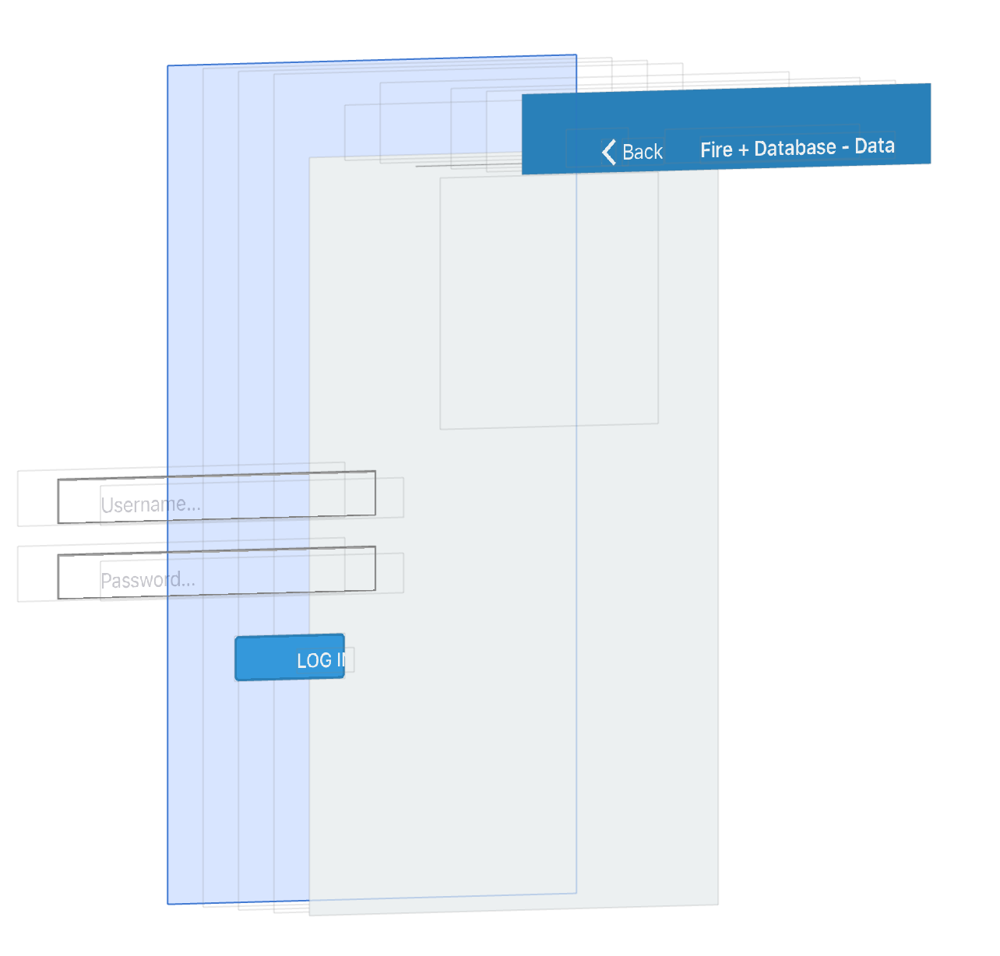

# AC3.2-MidUnit-6-Exam
---

### Animations

If you're like me (and I know you are), you must be craving for a login screen to use for authenticating Firebase users. It keeps me up at night, and I don't want to let that happen to you! So, this problem will look at adding in a series of simple animations to liven-up a login screen for our app, **Fire + Database - Data**. 

A lot of code has been provided for you so that you may focus on getting the animations just right. When you fork this repo, take a moment to look over the code that is written in `AnimationsViewController`. You shouldn't need to change anything in the sections that are marked, but you may temporarily comment out code if you find it useful to debug. Just make sure to uncomment that code before submitting your final PR. 

**FINAL PRODUCT YOU MUST HAVE FOR FULL CREDIT:**

[See final animations by clicking here!](https://gfycat.com/SimilarFlawedAchillestang)

---

### Where to begin:

I suggest looking at your view hierarchy debugger to get a sense for where stuff is. To help you out, here are some screenshots of the project right now:

#### Looking straight ahead:

#### Looking at an angle:

#### Best Advice:

*Don't try to do everything at once*

Break down the task into its smaller components. For example, you could start with just the [scale & fade of the logo (click me to view).](https://gfycat.com/WellinformedMinorBordercollie). After you have that working, move onto the first `containerView` and get the [sliding animation working (click me to view)](https://gfycat.com/HarmfulCheapKusimanse). Then, get the [password `containerView` working](https://gfycat.com/VerifiableInnocentCrow). 

---
